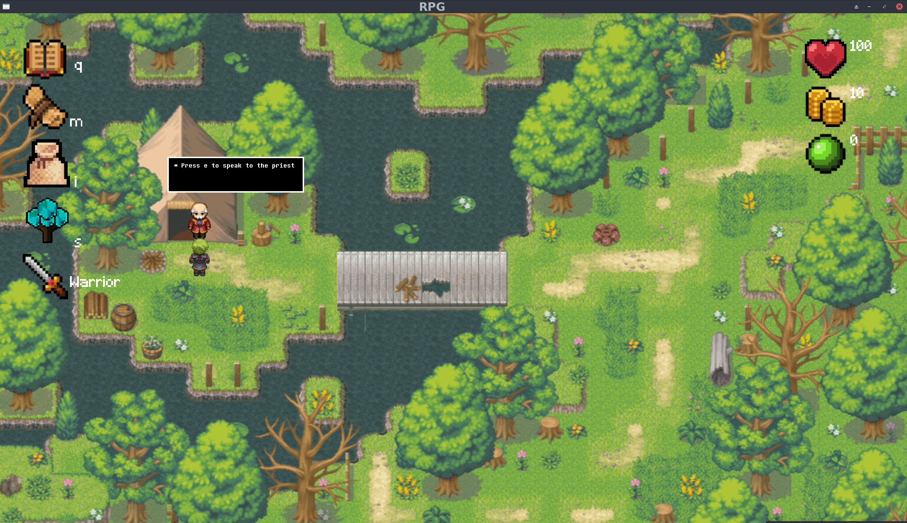
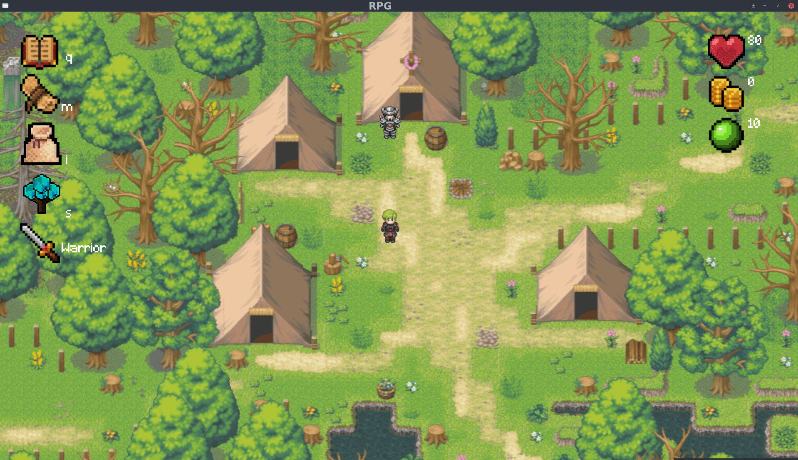
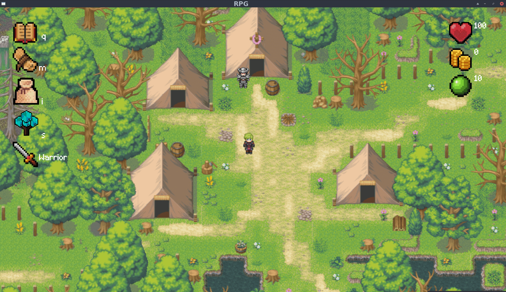

# MyRPG / Heimdall
A fantasy RPG made in group of 4 with the __CSFML Lib__ . 
<kbd>./my_rpg -h for usage <kdb />  

Project made in __C__ with __Maxime Le-borgne, Ilias Lamrani, Yheb Kanzari__.

 Our main goal was to create and develop a __nice and pleasant game__ focused on a __smooth gameplay__ and __great UI__ without having any crash. 

## Introduction
### Organisation
 * Use of a "Trello" to list all features to do, what is done and who is working on what features.
 * Project made while we were quarantined so we had to discuss a lot everyday about everything in the project.
 * Brainstorming, and talking a lot for the conception of the project for a few days.
 * Each features coded has to be approved by the group or is reworked until we are all satisfied if we do have enough time.
 * We share our problems and code parts done through all the day.
 
### Project length
 * __1 month__ while working on 2 others projects in the same time

## A short demonstration
 * ### Menu screen 
 
  
 * ### Moving on the map
 (Movements are __way more smooth in-game__, this is due to the gif format)
 
 
 * ### Quest examples
The first quest out of the 3 others
 

* ### UI examples
#### Quest log
 
#### Minimap
 
#### Inventory
 
#### Skill tree
Bonuses may be purchased depending the number of "xp" (green ball on the right) you have. 
Either you chose to upgrade your damages or increase potion efficiency
 

 * ### Fights examples
 #### Boss fight
 Damages done may change depending your classes, skill tree, secondary quests...
 

## Author
 * Christophe Sourinthone
 
## License
This project is licensed under the BSD 2-Clause "Simplified" License - see the LICENSE.md file for details 
